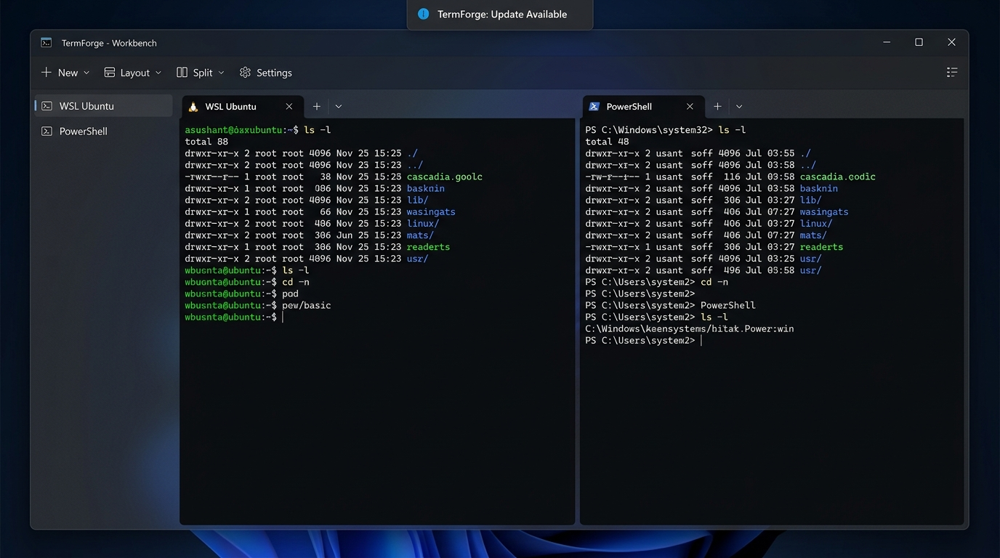
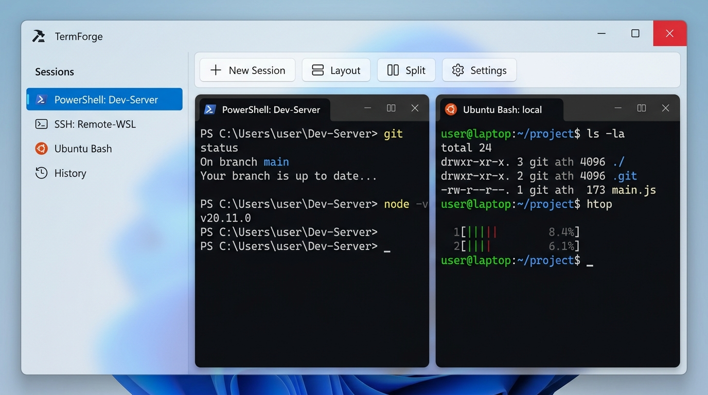

# TermForge — Windows 11 Fluent 原生设计稿规范 (Design Spec)

> **版本**：v1.0.0  
> **依据 OpenSpec**：[`openspec/changes/modernize-win11-fluent-ui`](../../openspec/changes/modernize-win11-fluent-ui/)  
> **目标基线**：.NET 10 (LTS) + Windows 11 22H2+ (Build 22621+)  
> **交互原型**：[win11_fluent_preview.html](./win11_fluent_preview.html)  
> **设计稿原件**：
> - 深色设计稿：[`win11_fluent_terminal_dark.jpg`](./images/win11_fluent_terminal_dark.jpg)
> - 浅色设计稿：[`win11_fluent_terminal_light.jpg`](./images/win11_fluent_terminal_light.jpg)

---

## 1. 设计概述与设计哲学

根据最新 OpenSpec 变更要求，TermForge 主窗口外壳全面告别以往基于 XAML 纯渐变模拟的 Windows 7 Aero 贴皮假玻璃，演进为 **Windows 11 Fluent 原生外壳**。

本次设计的核心哲学为：**外壳极致融入系统，内部保持硬核锻造**。
1. **外壳原生化 (Authentic Fluent Shell)**：
   利用 Windows 11 DWM 系统材质（Mica/Mica Alt）、系统阴影、12px 圆角、深浅模式与系统强调色跟随、以及原生 Snap Layouts 贴靠手感，带来真正意义上的现代化 Windows 11 桌面工坊体验。
2. **终端视口绝对隔离 (Zero-Loss Viewport Guard)**：
   MDI 终端内容区严格执行 `#0C0F14` 纯黑隔离契约——**绝对禁止**施加任何 Mica 模糊、毛玻璃滤镜、圆角裁剪或透光着色，确保 ConPTY 与 VT 渲染流水线具备零损耗性能与最高的代码辨识度。
3. **MMC 工作台结构延续**：
   完整保留经典 MMC 控制台三栏结构（左侧会话导航树、中部 MDI 多终端视口、底部状态栏、右侧可折叠诊断/属性栏），兼顾专业工程人员的工作流习惯。

---

## 2. 视觉设计稿展示

### 2.1 深色模式设计稿 (Dark Mode - Default)



- **外壳材质**：Mica 主窗口材质（`DWMSBT_MAINWINDOW`），透出桌面深邃光影。
- **导航侧边栏**：轻量 Acrylic 亚克力半透明面板，层次分明。
- **视口**：4 窗平铺 MDI 布局，字符视口高对比度 `#0C0F14`，搭配 Cascadia Code 语法着色。
- **标题栏**：集成 Windows 11 原生控制按钮，悬停最大化按钮提供 Snap Layouts 网格。

### 2.2 浅色模式设计稿 (Light Mode)



- **外壳材质**：高质感浅灰 Mica（`#F3F3F3` 基调），1px 精细分界线。
- **强调色**：绑定系统当前强调色（默认 Windows Blue `#0078D4`），聚焦态与主要按钮呼应。
- **视口**：维持硬核深黑终端视口，形成高辨识度「黑白锻造台」层次。

---

## 3. 颜色与材质 Token 规范

### 3.1 材质映射与 DWM 属性契约

| 层级 (Layer) | Win11 22621+ 材质 | Win10 / 无 Mica 降级 | 高对比度模式 (High Contrast) |
| :--- | :--- | :--- | :--- |
| **主窗口背景 (Window)** | `DWMSBT_MAINWINDOW` (Mica) | 纯色实体背景 (`#202020` / `#F3F3F3`) | `#000000` (Canvas) |
| **导航侧栏 (Sidebar)** | `DWMSBT_TRANSIENTWINDOW` (Acrylic 65%) | 半透深灰 (`rgba(24,24,24,0.95)`) | `#000000` + 绿色分界线 |
| **MDI 容器背景 (Workspace)** | 沉浸微透深色 (`rgba(18,18,18,0.72)`) | 纯色底衬 (`#1E1E1E` / `#E5E5E5`) | `#000000` |
| **MDI 子窗标题栏 (Tab)** | 沉浸式实体卡片 (`rgba(44,44,44,0.92)`) | 纯色卡片 (`#2D2D2D` / `#F9F9F9`) | `#1A1A1A` + 白色 1px 边框 |
| **终端视口 (Terminal Viewport)** | **`#0C0F14` 纯实体（无滤镜）** | **`#0C0F14` 纯实体** | **`#0C0F14` 纯实体** |

### 3.2 语义颜色 Token 体系 (`Colors.xaml`)

```xaml
<!-- 语义颜色 Token 定义规范 -->
<!-- 强调色 Accent：动态取自 UISettings.GetColorValue(UIColorType.Accent) -->
<Color x:Key="SystemAccentColor">#0078D4</Color>
<SolidColorBrush x:Key="AccentBrush" Color="{DynamicResource SystemAccentColor}" />

<!-- 深色模式 Tokens -->
<SolidColorBrush x:Key="TextPrimaryBrush" Color="#FFFFFF" />
<SolidColorBrush x:Key="TextSecondaryBrush" Color="#B8FFFFFF" />
<SolidColorBrush x:Key="TextTertiaryBrush" Color="#73FFFFFF" />
<SolidColorBrush x:Key="SubtleBorderBrush" Color="#14FFFFFF" />
<SolidColorBrush x:Key="CardBackgroundBrush" Color="#0DFFFFFF" />
<SolidColorBrush x:Key="CardBackgroundHoverBrush" Color="#17FFFFFF" />

<!-- 终端固定隔离色 Token -->
<SolidColorBrush x:Key="TerminalViewportBackgroundBrush" Color="#0C0F14" />
<SolidColorBrush x:Key="TerminalViewportForegroundBrush" Color="#CCCCCC" />
```

---

## 4. 窗口 Chrome 与 Snap Layouts 规范

### 4.1 窗口几何度量 (Window Geometry)
- **外框圆角 (Outer Corner Radius)**：`12px`（由系统 `DWMWCP_ROUND=2` 自动控制）。
- **子窗口圆角 (MDI Subwindow Radius)**：`8px`（未最大化时），最大化到工作区时平铺为 `0px`。
- **系统投影 (System Drop Shadow)**：通过 `DwmExtendFrameIntoClientArea` 恢复系统层级 32px 扩散阴影。
- **标题栏高度 (Titlebar Height)**：`36px`（标准 Windows 11 单行 Caption 高度）。
- **控制按钮 (Caption Buttons)**：宽 `46px`，高 `32px`。关闭按钮悬停变红（`#C42B1C`）。

### 4.2 Snap Layouts 贴靠与最大化交互
- 鼠标悬停在主窗口「最大化」按钮上超过 200ms，系统弹出 Windows 11 原生 Snap 飞窗。
- 支持快速一键贴靠：
  1. **左右并排 (50/50)**
  2. **主从左右 (70/30)**
  3. **三栏均分 (33/33/33)**
  4. **四宫格象限 (Quad 2x2)**

---

## 5. 终端视口隔离契约 (Viewport Contract)

根据 OpenSpec `win11-fluent-shell/spec.md` §3：
```
Requirement: Terminal viewport stays isolated
Fluent materials, blur, rounded clipping, and decorative shadows SHALL NOT be applied to the terminal character viewport.
```

- **背景色**：强约束固定为 `#0C0F14`。
- **裁剪规则**：字符单元格区域四周边缘 padding 为 `8px`，内部禁止任何 `ClipToBounds` 圆角曲线。
- **字形渲染**：默认采用 `Cascadia Code`（Windows 11 首选开发等宽字体，支持 Ligatures 连字），回退为 `Consolas`。
- **光标动画**：标准 1000ms 脉冲闪烁块状光标。

---

## 6. 与 Windows 7 Aero 方案的全面对比

| 维度 | 旧方案 (Windows 7 Aero 模拟) | 新方案 (Windows 11 Fluent 原生) |
| :--- | :--- | :--- |
| **运行时基线** | .NET 8 LTS (已退居过渡态) | **.NET 10 LTS** (官方长期支持至 2028-11) |
| **外壳材质实现** | 自绘写死 `LinearGradientBrush` 贴皮 | **系统原生 DWM Mica / Mica Alt 材质** |
| **系统主题适应** | 固定单一天蓝色浅调，无法深色跟随 | **`ThemeMode=System`** 自动随系统深/浅/高对比度无缝切换 |
| **系统强调色** | 写死 `#2B78C5` 仿 Vista/Win7 蓝 | **动态绑定 Windows 系统 Accent Color** |
| **窗口手感** | 缺失系统投影、贴靠动画与 Snap 飞窗 | **系统级 Snap Layouts 贴靠**、系统原生外边框与柔和投影 |
| **图标体系** | 自绘矢量 Path Geometry / DrawingImage | **Segoe Fluent Icons** 字体与系统矢量符号体系 |
| **终端视口** | `#0C0F14` 隔离 | **`#0C0F14` 持续严格隔离（零渲染退化）** |

---

## 7. 交互原型使用指引

开发者与评审者可直接在浏览器中打开：
[`docs/design/win11_fluent_preview.html`](./win11_fluent_preview.html)

**可交互测试项**：
1. **主题快速切换**：在顶部控制栏点击「深色 Dark」、「浅色 Light」或「高对比度 HC」。
2. **材质即时切换**：点击「Mica」、「Acrylic」或「纯色降级」体验不同系统环境下的视觉回退。
3. **系统强调色切换**：实时尝试默认蓝、紫罗兰、翡翠绿、珊瑚红、琥珀橙，观察所有按钮与激活焦点色的动态适配。
4. **MDI 窗口操作**：可拖拽子窗标题栏移动窗口、双击最大化、切换活动窗口以及一键执行「平铺/层叠」排版。
5. **Snap Layouts 悬停**：鼠标悬停在标题栏最大化按钮上查看 Windows 11 贴靠飞窗。
