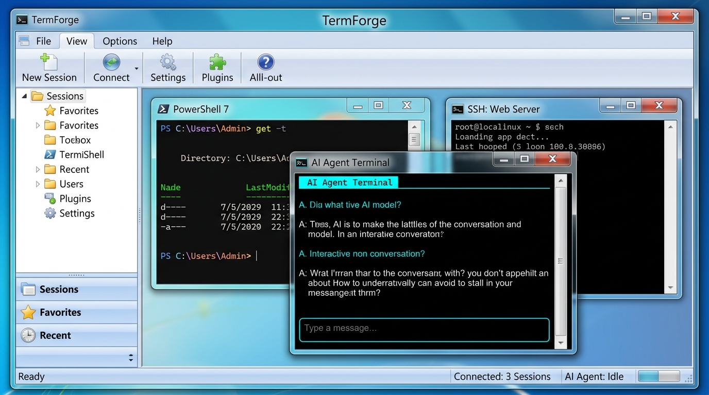

# TermForge - Windows 7 Aero Glass UI 设计规范与实施方案

> 终端之锻造台 / The Terminal Workspace & Agent CLI for Windows  
> 视觉风格规范文档：Windows 7 Aero Glass + MMC MDI 多文档终端工作台

---

## 📸 1. 视觉效果设计稿 (UI Mockup)



### 💡 高保真可交互原型 (Interactive Prototype)
项目仓库内已内置纯前端可交互原型，无需额外工具，直接双击或使用浏览器打开即可体验：  
👉 [本地交互原型入口: ./win7_aero_preview.html](./win7_aero_preview.html)

**原型内置交互功能：**
* 🖱️ **MDI 子窗口拖动与聚焦**：子窗口自由平滑移动、拖动边界、鼠标点击置顶高亮当前活动窗口（未激活窗口自动降饱和呈现冷灰玻璃）。
* 📐 **窗口自动排布联动**：工具栏一键执行 **层叠 (Cascade)**、**水平平铺 (Tile Horizontal)** 与 **垂直平铺 (Tile Vertical)**。
* 🎨 **实时 Aero 色调切换**：天青 (Sky Cyan)、翡翠绿 (Sea Green)、石墨灰蓝 (Slate)、暮光粉紫 (Twilight)、暖琥珀 (Amber)。
* ➕ **会话动态拉起**：模拟新建 PowerShell 7、AI Agent CLI 与 WSL 会话并载入终端。

---

## 🌟 2. 设计理念与美学目标

TermForge 核心定位为 **Windows 原生、专业级 Shell 与 AI Agent 集成终端工作台**。在视觉层面引入 **Windows 7 Aero Glass** 拟物经典美学，旨在实现：

1. **经典拟物与现代终端碰撞**：将 2009 年代 Windows 巅峰时期的晶莹通透、高光反射与现代深色高对比字符网格终端完美结合。
2. **MMC (Microsoft Management Console) 工作台规范**：采用经典 3 栏式架构（左侧控制台树状导航、中央 MDI 多文档活动区、右侧属性/操作区、底部状态栏）。
3. **“外透内敛”的视觉对比**：外层窗框、标题栏、工具栏通透轻盈；终端文字视口深沉内敛（`#0C0F14`），保障极客与工程师长时间码字、审查 Agent 流式输出时不产生视觉疲劳。

---

## 🎨 3. 详细视觉规范与色彩系统

### 3.1 Aero Glass 调色板

| 预设风格 | 主色代码 (HEX/RGBA) | 适用场景 / 语义 |
| :--- | :--- | :--- |
| **天青默认 (Sky Cyan)** | `rgba(165, 205, 235, 0.50)` | 默认系统玻璃窗框、活动 MDI 子窗口 |
| **石墨灰蓝 (Graphite/Slate)** | `rgba(150, 160, 180, 0.55)` | 未激活子窗口、低对比度安静模式 |
| **翡翠绿 (Sea Green)** | `rgba(140, 200, 165, 0.50)` | 生产环境 / 正常在线健康会话 |
| **暮光粉紫 (Twilight Purple)** | `rgba(200, 155, 180, 0.50)` | AI Agent 专属会话 / 实验性工作区 |
| **暖琥珀 (Warm Amber)** | `rgba(225, 175, 130, 0.50)` | 调试态 / 高权限 (Elevated Admin) 警告态 |

### 3.2 玻璃材质与高光反光带 (Sheen)

* **边框圆角 (Border Radius)**：
  * 主窗口：`8px`
  * MDI 子窗口：`6px`
  * 按钮：`3px`（Windows 7 经典微圆角胶囊感）
* **高光反射层 (Specular Sheen)**：
  * 窗口顶部 30px 高度覆盖 45% 线性渐变白色遮罩：
    `LinearGradient: White (75%) -> White (25%) -> Transparent (50%) -> White (15%)`
* **双线金属/高光外轮廓 (Dual-line Border)**：
  * 外层深色边缘：`1px solid rgba(0, 0, 0, 0.35)`
  * 内层高光折射：`inset 0 1px 0 rgba(255, 255, 255, 0.9)`

### 3.3 标题栏文字与发光光晕 (Title Glow)

* **字体族**：`Segoe UI`, `Tahoma`, `sans-serif`
* **字号与字重**：`12px (9pt)`, `Bold (SemiBold)`
* **前景色**：深墨蓝 `#0C1A26`
* **光晕滤镜 (Text Glow Effect)**：
  * 必须配置纯白多重外发光软阴影，避免透出的壁纸或下方暗色内容影响标题可读性：
    `DropShadowEffect: Color=#FFFFFF, BlurRadius=10, Opacity=0.95, ShadowDepth=0`

### 3.4 经典窗口控制按钮 (Caption Buttons)

* **最小化 / 最大化 (Min / Max)**：
  * 尺寸：`29px × 20px`
  * 常态材质：透明青白反光渐变 (`#FFFFFF 40% -> #C8E6FF 20% -> #96C8F0 30% -> #DCF0FF 50%`)
  * 悬停状态：发光水蓝 (`rgba(0, 180, 255, 0.75)` 外发光)
* **关闭按钮 (Close Button)**：
  * 尺寸：`48px × 20px`
  * 常态材质：红宝石果冻渐变 (`#F2B2A8 -> #E06E60 -> #C41E14 -> #E45044`)
  * 悬停状态：炽热荧光红，外发光 `0 0 10px rgba(255, 50, 40, 0.9)`，右上圆角契合窗框。

---

## 🗂️ 4. MMC 工作台组件设计规范

### 4.1 菜单栏与工具栏 (Explorer / MMC Ribbon)
* **背景底色**：柔和淡灰蓝阶梯渐变 `#FAFBFD -> #EBEDF2 -> #E1E4EB`
* **分界线**：金属蚀刻双线（上层 `#CDD1D9`，下层 `#FFFFFF` 带来浮雕立体感）
* **按钮样式**：圆角 3px，天蓝描边 `#9FB4CC`，内衬 1px 纯白高光，悬停激活天蓝色发光。

### 4.2 左侧 MMC 导航树 (Console TreeView)
* **背景**：淡灰白渐变 `#FCFDFE -> #F1F4F8`，右侧 `1px solid #C2CAD6` 分割。
* **节点选中态**：Windows 7 经典天蓝渐变条 `#E4F0FA -> #CCE5F7`，边框 `#79A7D3`。
* **图标规范**：Windows 7 风格黄色文件夹、控制台根节点节点图标、Shell 会话指示灯。

### 4.3 中央 MDI 工作区 (MdiCanvas & MdiWindow)
* **画布底色**：`#1B2631` 点阵网格壁纸（兼顾深色终端的沉浸感与工程专业度）。
* **活动子窗口 (Active MdiWindow)**：
  * 窗体边框发光 `rgba(50, 160, 255, 0.4)`，高饱和天青毛玻璃标题栏，纯白文字光晕。
* **非活动子窗口 (Inactive MdiWindow)**：
  * 边框降暗，玻璃呈现浅冷灰（`rgba(215, 225, 235, 0.35)`），标题文字呈现柔灰蓝 `#4A5C6D`。
* **窗口操作**：
  * 支持拖动标题栏在画布内移动并限制边界；
  * 双击标题栏在 MDI 画布内最大化/还原；
  * 快捷支持层叠与平铺排布。

### 4.4 终端渲染核心区 (Terminal Viewport)
* **背景色**：`#0C0F14`（深空炭黑）
* **字体**：`Cascadia Code`, `Consolas`, `Lucida Console`，11pt/12pt
* **光标**：荧光青色跳动方块光标（Blinking Cursor）
* **输出支持**：标准 VT / TrueColor 高亮语法、Claude Code / Agent CLI 结构化气泡与卡片输出。

### 4.5 底部状态栏 (Aero StatusBar)
* **底色**：`#E5E9F0 -> #D3D9E3 -> #C4CCD8 -> #D9E0EB`
* **状态槽 (Panels)**：立体嵌入手感（左侧 `#B8C1CE` 暗边，右侧 `#FFFFFF` 亮边）。
* **缩放把手 (Resize Grip)**：右下角保留经典 Windows 7 点阵缩放把手。

---

## 💻 5. WPF (.NET 8) 落地实施方案

### 5.1 架构实现策略选型

现代 Windows (Win10 2004+ / Win11) 的 DWM 桌面窗口管理器已全面弃用了 Windows 7 的原生玻璃模糊合成器。若直接调用旧版 Win32 DWM API 往往会导致窗口黑边或直接降级为纯白。

因此，TermForge 采用 **方案 A：纯 XAML 矢量渐变 + WindowChrome 接管（推荐，100% 像素级跨系统一致）**：
1. 使用 `WindowChrome` 实现非客户区与原生缩放手势支持；
2. 外层以 `Border` 承载 `LinearGradientBrush` 复合反射光圈与 `DropShadowEffect`；
3. 子窗口 `MdiWindow` 使用相同的 Aero 模板进行局部半透明渲染；
4. 无论用户在 Windows 10、Windows 11 还是开启深色/浅色模式，均能 100% 精确还原 Windows 7 Aero 视效。

### 5.2 XAML 资源字典架构设计

建议在 `src/AgentTerminal.App/Themes/` 下建立独立的主题资源字典：

```text
src/AgentTerminal.App/Themes/
├── AeroTheme.xaml          # Windows 7 Aero 完整资源字典（画刷、文字特效、控件模板）
├── DarkTheme.xaml          # 现有的 VS 极客深色主题
└── ThemeManager.cs         # 主题动态加载与热切换管理器
```

#### 关键 XAML 核心片段定义 (AeroTheme.xaml)

```xml
<!-- 1. Aero 标题文字光晕 -->
<Style x:Key="AeroTitleTextBlockStyle" TargetType="TextBlock">
    <Setter Property="FontFamily" Value="Segoe UI, Tahoma"/>
    <Setter Property="FontWeight" Value="Bold"/>
    <Setter Property="FontSize" Value="12"/>
    <Setter Property="Foreground" Value="#0C1A26"/>
    <Setter Property="VerticalAlignment" Value="Center"/>
    <Setter Property="Effect">
        <Setter.Value>
            <DropShadowEffect Color="#FFFFFF" BlurRadius="10" ShadowDepth="0" Opacity="0.95"/>
        </Setter.Value>
    </Setter>
</Style>

<!-- 2. Aero 红宝石关闭按钮 ControlTemplate -->
<Style x:Key="AeroCloseButtonStyle" TargetType="Button">
    <Setter Property="Width" Value="48"/>
    <Setter Property="Height" Value="20"/>
    <Setter Property="WindowChrome.IsHitTestVisibleInChrome" Value="True"/>
    <Setter Property="Template">
        <Setter.Value>
            <ControlTemplate TargetType="Button">
                <Border x:Name="bd" CornerRadius="0,0,4,0" BorderThickness="1,0,1,1" BorderBrush="#80B43C3C">
                    <Border.Background>
                        <LinearGradientBrush StartPoint="0,0" EndPoint="0,1">
                            <GradientStop Color="#D8F2B2A8" Offset="0.0"/>
                            <GradientStop Color="#B0E06E60" Offset="0.48"/>
                            <GradientStop Color="#D8C41E14" Offset="0.52"/>
                            <GradientStop Color="#F0E45044" Offset="1.0"/>
                        </LinearGradientBrush>
                    </Border.Background>
                    <Path Data="M 1.5,1.5 L 8.5,8.5 M 8.5,1.5 L 1.5,8.5" Stroke="#FFFFFF" StrokeThickness="2"
                          HorizontalAlignment="Center" VerticalAlignment="Center"/>
                </Border>
                <ControlTemplate.Triggers>
                    <Trigger Property="IsMouseOver" Value="True">
                        <Setter TargetName="bd" Property="Background">
                            <Setter.Value>
                                <LinearGradientBrush StartPoint="0,0" EndPoint="0,1">
                                    <GradientStop Color="#FFFFAAA0" Offset="0.0"/>
                                    <GradientStop Color="#F2F05A4B" Offset="0.48"/>
                                    <GradientStop Color="#FFD7140A" Offset="0.52"/>
                                    <GradientStop Color="#FFFF6455" Offset="1.0"/>
                                </LinearGradientBrush>
                            </Setter.Value>
                        </Setter>
                        <Setter TargetName="bd" Property="Effect">
                            <Setter.Value>
                                <DropShadowEffect Color="#FF3228" BlurRadius="10" ShadowDepth="0" Opacity="0.95"/>
                            </Setter.Value>
                        </Setter>
                    </Trigger>
                </ControlTemplate.Triggers>
            </ControlTemplate>
        </Setter.Value>
    </Setter>
</Style>

<!-- 3. Aero 胶囊工具栏按钮 -->
<Style x:Key="AeroToolBarButtonStyle" TargetType="Button">
    <Setter Property="Height" Value="24"/>
    <Setter Property="Padding" Value="8,2"/>
    <Setter Property="BorderThickness" Value="1"/>
    <Setter Property="BorderBrush" Value="#9FB4CC"/>
    <Setter Property="Foreground" Value="#1E395B"/>
    <Setter Property="FontSize" Value="11"/>
    <Setter Property="Template">
        <Setter.Value>
            <ControlTemplate TargetType="Button">
                <Border x:Name="bd" CornerRadius="3" Background="#E5EDF6" BorderBrush="{TemplateBinding BorderBrush}" BorderThickness="1">
                    <ContentPresenter HorizontalAlignment="Center" VerticalAlignment="Center" Margin="{TemplateBinding Padding}"/>
                </Border>
                <ControlTemplate.Triggers>
                    <Trigger Property="IsMouseOver" Value="True">
                        <Setter TargetName="bd" Property="Background" Value="#D5E8F9"/>
                        <Setter TargetName="bd" Property="BorderBrush" Value="#5C8FC2"/>
                    </Trigger>
                </ControlTemplate.Triggers>
            </ControlTemplate>
        </Setter.Value>
    </Setter>
</Style>
```

---

## 🗺️ 6. 实施路线图与任务拆解

* [x] **设计提案与视觉效果图生成**：生成高保真设计图与设计参数文档。
* [x] **本地交互原型开发**：创建纯 CSS/JS 可交互原型 `docs/design/win7_aero_preview.html`。
* [x] **设计规范归档**：将规范与资源建立在 `docs/design/` 下，完成工程文档对齐。
* [ ] **Phase A (XAML 资源化)**：
  * 在 `AgentTerminal.App` 中创建 `Themes/AeroTheme.xaml`；
  * 提取通用色彩、发光 TextBlock 模板、三色窗口控制按钮样式、胶囊式工具栏样式。
* [ ] **Phase B (主窗体与 WindowChrome 适配)**：
  * 在 `MainWindow.xaml` 引入 `WindowChrome` 与 Aero 外层反射外壳；
  * 适配标题栏拖动、双击最大化与系统快捷键。
* [ ] **Phase C (MDI 子窗口 Aero 边框)**：
  * 在 `MdiWindow` 控件中应用 Aero 材质模板，区分活动与非活动透明度及发光状态。
* [ ] **Phase D (双主题一键热切换)**：
  * 编写 `ThemeManager`，在“视图”菜单中提供 **“Windows 7 Aero 经典”** 与 **“VS Code 深色极客”** 风格一键热切换。
